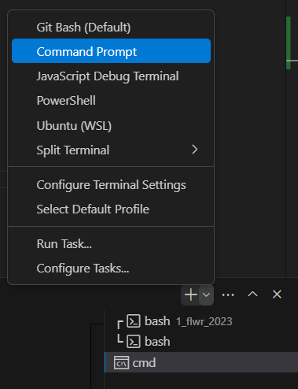
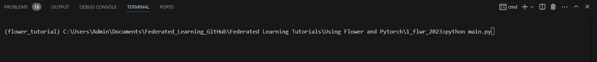
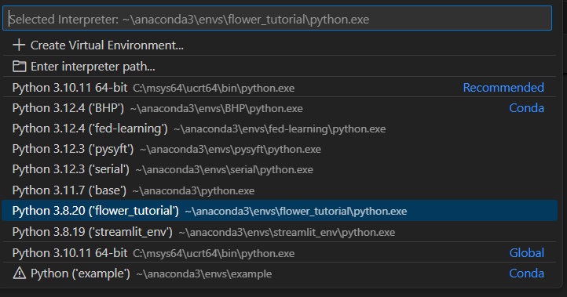

- GitHub link: https://github.com/adap/flower/tree/c8120f2669fef0f2e6815ab1e957e5366d06d19d/examples/flower-simulation-step-by-step-pytorch

- YouTube Playlist: https://www.youtube.com/playlist?list=PLNG4feLHqCWlnj8a_E1A_n5zr2-8pafTB

# Steps:

```
# I'm running this on an Windows (GPU is not required)

# create the environment in Anaconda Prompt (Install Anaconda beforehand)
conda create -n flower_tutorial python=3.9 -y

conda activate flower_tutorial

# install PyToch (other versions would likely work)
conda install pytorch==1.13.1 torchvision==0.14.1 torchaudio==0.13.1 pytorch-cuda=11.6 -c pytorch -c nvidia -y
# conda install pytorch==1.13.1 torchvision==0.14.1 torchaudio==0.13.1 -c pytorch -y # If you don't have a GPU

# Install Flower and other dependencies
pip install -r requirements.txt
```
# How to solve Error:

- Do these steps in case you are encountering an error while running the code in VS Code:
1. Select `Terminal` from menu bar

2. Select `Command Prompt` from the dropdown menu here

3. Execute main.py in terminal


Note: Make sure to select correct interpreter as below:
1. Press Ctrl+Shift+P
2. Type `Python: Select Interpreter` and select it from list

3. Select 'flower_turial' (i.e your conda env name) list

